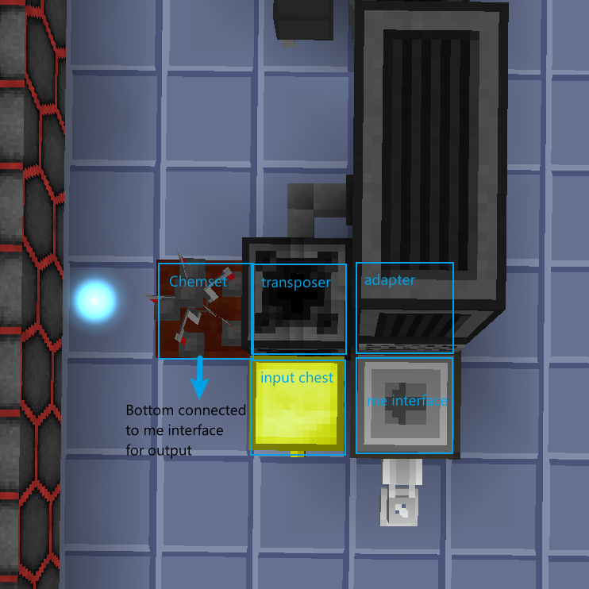
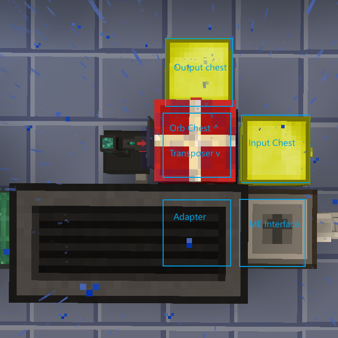
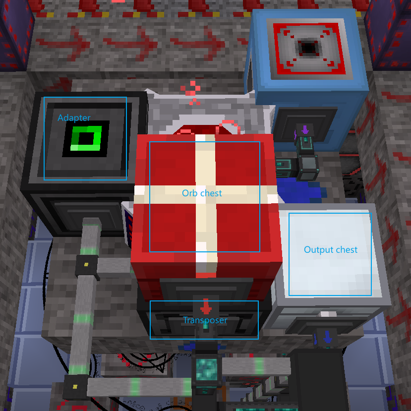
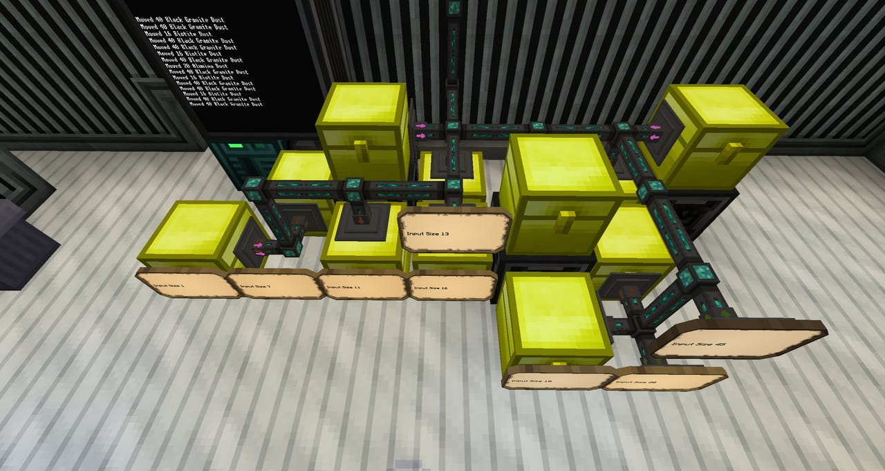

# OpenComputer Scripts for GTNH

## Install

    wget https://raw.githubusercontent.com/joegnis/oc-scripts-gtnh/install.lua
    ./install.lua

```
Usage:
./install [-b|--branch BRANCH] [-u|--update-file FILE]
./install [-b|--branch BRANCH] [-c|--update-config]
./install --help | -h

Options:
  -b --branch BRANCH     Downloads from a specific branch. Default is %s.
  -u --update-file FILE  Updates a specific file.
  -c --update-config     Updates all config files.
  -h --help              Shows this message.

By default, this script always (re)downloads all source files except for
config files. For config files, it downloads all missing ones but does
not download existing ones.

When it updates a config file, it backs up existing one before proceeding.
```

## Automating Blood magic Alchemic Chemistry Set

Automates item crafting in BM chemistry set.
To run: `./bm_alchemist.lua`. Config file: `bm_alchemist_config.lua`.

Script first reads AE patterns when launched, and after having detected materials in input chest, it tries matching patterns' input materials with them and then put them one by one into the chemistry set if matched.

Requirements:
- 1 computer
- 1 Adapter
- 1 Transposer
- 1 ME Interface
- Alchemic Chemistry Set
- 1 Blood Orb
- ...

See the illustration below for an example setup. Additionally,
- route the output (bottom) of Chemset to ME Interface;
- put Blood Orb into Chemset with the orb's tier high enough to craft the recipes we want;
- put AE patterns in the interface (Patterns should have exactly 5 inputs and 1 output).

Maintenance:
- After adding any new pattern, rerun the script.
- Press Ctrl-C to quit the script while it is running.



## Automating Blood Altar

Automates item crafting and blood network refilling in BM Blood Altar.
To run: `./blood_altar.lua`. Config file: `blood_altar_config.lua`.

Script works in a similar way of the chemistry set script to automate item crafting. Additionally, when a blood orb is present in the orb chest, it puts the orb onto Altar when Altar is idle to keep player's blood network filled.

Requirements:
- 1 computer
- 2 Transposers
- 1 Adapter
- 1 Blood Orb (optional)
- Some chests
- Some item conduits (or other item transfer methods)
- Some OC cables/network conduits

See the illustration below for an example setup. This setup is split into two parts: one for computer case and processing inputs; another for interfacing with Altar. We don't have to do this, but Altar usually needs room for rituals and I find it easier to set up without a space limitation.
To connect the two parts together:
- route items from Input-side output chest to the bottom of Altar;
- route items from Altar-side orb chest to Input-side orb chest
- route items from Altar-side output chest to Input-side ME Interface
- connect Altar-side transposer to Input-side computer






## Regulating Stack Size

Moves items from input chests to output chests in stacks of size in certain multiples.
To run: `./regulate_size.lua`. Config file: `regulate_size_config.lua`.

Requirements:
- 1 computer
- 1 or more Transposers
- Some chests
- ...

Installation:
- Put chests around Transposer(s): for each Transposer, one input chest per multiple and at least one output chest.
- Change config file accordingly.


